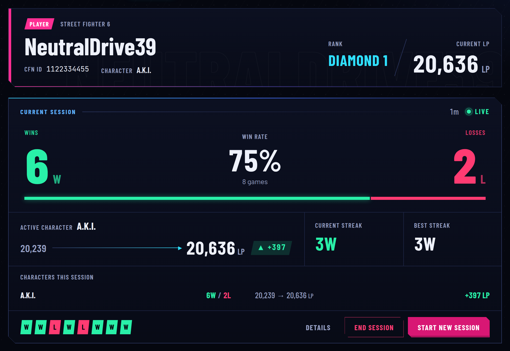
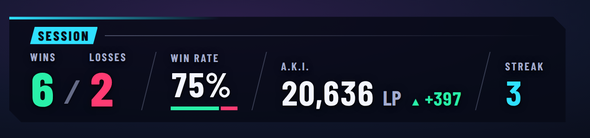
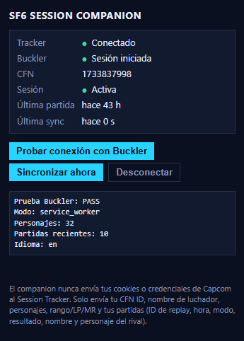
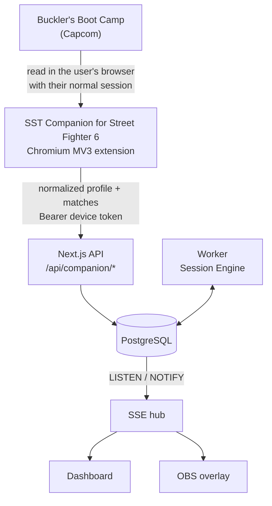

# SST — Session Stats Tracker

**Session tracking & overlays for fighting games.**

Currently supported: **Street Fighter 6**

[](https://github.com/SRGarciaVel/sf6-session-tracker/actions/workflows/ci.yml)


[](LICENSE)

SST is for fighting-game players and streamers. You start a session and play Ranked. Your wins,
losses, win rate, streaks and rating change for each character update on a dashboard and on an
OBS overlay, with no hotkeys or manual counters. Street Fighter 6 is the only supported game today.

For Street Fighter 6, match data comes from **Buckler's Boot Camp**. A small Chromium extension,
the **SST Companion for Street Fighter 6**, reads it inside your own logged-in browser. Your
Capcom credentials and cookies never reach the server.

> SST is not affiliated with or endorsed by Capcom. Street Fighter and Street Fighter 6 are
> trademarks of Capcom Co., Ltd.

---

## Screenshots

Real captures of the running app. The dashboard and overlay use demo data generated through the
actual pipeline (mock provider, a fake CFN). The companion capture comes from a real browser
session. URLs and tokens are not shown. The captures predate the SST rename and may show the
previous branding; the features shown are current.

**Dashboard**: live session, active character, rank, LP change, W/L, win rate and streaks.



**OBS overlay**: the Browser Source (Competitive theme), shown here over a dark backdrop. In OBS
it is transparent.



**SST Companion for Street Fighter 6**: browser companion connected to Buckler and ready to sync.



## Contents

- [Screenshots](#screenshots)
- [Features](#features)
- [Architecture](#architecture)
- [Privacy](#privacy)
- [Security](#security)
- [Quick start](#quick-start)
- [Environment variables](#environment-variables)
- [SST Companion for Street Fighter 6](#sst-companion-for-street-fighter-6)
- [Closed Beta](#closed-beta)
- [OBS setup](#obs-setup)
- [Development commands](#development-commands)
- [Project status](#project-status)
- [Known limitations](#known-limitations)
- [Repository structure](#repository-structure)
- [Documentation](#documentation)
- [Contributing](#contributing) · [License](#license)

## Features

**Sessions and stats**

- Session-based tracking: **Start session** takes a baseline. Every later match counts only once,
  even if it is fetched again or arrives out of order.
- Wins, losses, win rate, current and best streak, recent form and session duration.
- **Multi-character ratings.** LP/MR belong to each character. Each character has its own session
  baseline, and the app never subtracts one character's rating from another's or LP from MR.
- The rank and the active character (the last one played) are shown automatically.
- Session history with a recap page per session.

**Data pipeline**

- Automatic ingestion from Buckler through the companion. Profile and battlelog are normalized
  in the browser by the same code the server uses.
- Duplicate protection keyed on the replay id, enforced by a unique index in the database.
- Recovery after a pause or restart: the companion walks back the battlelog until it finds a
  match the tracker already knows. A possible gap is reported, never hidden.
- The backend is authoritative for sessions, W/L, baselines, deltas and deduplication.

**Streaming**

- OBS Browser Source overlay with three themes (Minimal, Competitive, Street) and a visual
  builder with live preview.
- Persistent overlay URL: design changes apply live and the URL stays the same.
- Realtime updates over **SSE**. A reload or scene change never resets the stats.
- Spanish and English for both the dashboard and the overlay, set independently.

**In beta:** the SST Companion for Street Fighter 6 (Chromium only) and the whole live-data pipeline. See
[Project status](#project-status).

## Architecture



- **Buckler is queried in the browser**, not by the server. Server-side access is blocked
  (CloudFront 403, and Capcom's login verification fails under automation). See
  [docs/research](docs/research/2026-10-03-cfn-network-research.md).
- **Capcom cookies never reach the backend.** The extension sends normalized data only.
- **The backend is authoritative.** Ingestion deduplicates and assigns matches to sessions under
  a database lock. The pure **Session Engine** (`src/domain/session`) computes the stats.
- **The worker** keeps tracking state and profile snapshots up to date. Multiple workers
  coordinate through database leases. It runs as its own process (split deploy) or inside the
  web server (`TRACKER_RUNTIME_MODE=embedded`, single-service closed beta).
- **OBS never talks to Capcom** or to the extension. It reads the authoritative state from the
  server over SSE.

More detail: [docs/architecture.md](docs/architecture.md) and [docs/companion.md](docs/companion.md).

## Privacy

The companion **does not transmit** your Capcom password, your Buckler cookies or any Capcom
session token.

It sends only the normalized data the tracker needs:

- your CFN id and fighter name;
- per-character rank, LP and MR;
- for each match: replay id, time, mode and result, your character, and your opponent's display
  name, character and rank.

Payloads are built from an allow-list. A guard blocks credential-like keys on the client, and the
server rejects them.

What is stored and for how long is listed in
[docs/security-audit.md § Privacy](docs/security-audit.md#sec-015--privacidad-y-retención-low-accepted-documentado).
Account deletion and data retention policies are **not implemented yet**.

## Security

- **Companion pairing:** one-time code, valid for 10 minutes, exchanged for a device token.
- **Device tokens:** 256-bit, stored as SHA-256 only, revocable from the dashboard and the
  extension, and revoked automatically after 90 days unused.
- **Strict validation:** server-side schemas, unknown top-level keys rejected, and limits on body
  size (enforced while streaming), match count and timestamps.
- **Rate limiting:** shared across instances (Postgres) in production, for auth and app
  endpoints.
- **Ownership checks on every resource.** Companion data is scoped per account, so one account can
  never feed another's sessions.
- **Overlay URLs:** read-only, 192-bit tokens, rotatable; `no-referrer`, `noindex` and
  `no-store`.
- **Headers:** CSP per surface (the app cannot be framed; the overlay can be embedded), HSTS on
  https.

Full report, threat model and production requirements:
[docs/security-audit.md](docs/security-audit.md). To report a vulnerability, see
[SECURITY.md](.github/SECURITY.md).

## Quick start

**Requirements**

- Node.js **≥ 22.12** (`.nvmrc`: 22)
- pnpm **12** (`corepack enable pnpm`)
- PostgreSQL **15+** (a Docker Compose file is included)
- A Chromium-based browser (Chrome, Edge or Brave) for the companion

**Install and run**

```bash
git clone https://github.com/SRGarciaVel/sf6-session-tracker.git && cd sf6-session-tracker
corepack enable pnpm
pnpm install
cp .env.example .env   # then set BETTER_AUTH_SECRET: openssl rand -base64 32
docker compose up -d   # Postgres on localhost:5433, plus the sf6_tracker_test database
pnpm db:migrate
pnpm dev               # web on http://localhost:3000 + tracking worker
```

**Try it without Buckler:** keep `SF6_PROVIDER=mock` and `ENABLE_DEV_TOOLS=true`, then run
`pnpm db:seed` (login `demo@sf6.local` / `demo-password-123`, a fake CFN). The dashboard shows a
**Dev tools** panel that simulates matches through the real pipeline.

**Real data:** set `SF6_PROVIDER=companion` and follow
[SST Companion for Street Fighter 6](#sst-companion-for-street-fighter-6).

## Environment variables

All variables are validated at startup (`src/server/env.ts`). `.env.example` has working local
defaults. Never commit real values.

**Required**

| Variable             | Purpose                                                                                                                    |
| -------------------- | -------------------------------------------------------------------------------------------------------------------------- |
| `DATABASE_URL`       | Postgres connection string                                                                                                 |
| `BETTER_AUTH_SECRET` | ≥ 32 random characters. The `.env.example` placeholder is rejected in production                                           |
| `APP_URL`            | Public base URL (overlay URLs, auth origin checks)                                                                         |
| `SF6_PROVIDER`       | `mock` (simulated), `companion` (real data through the extension) or `capcom` (server prototype, not usable in production) |

**Optional / configuration**

| Variable                                                                                                                                                    | Purpose                                                                                                               |
| ----------------------------------------------------------------------------------------------------------------------------------------------------------- | --------------------------------------------------------------------------------------------------------------------- |
| `TEST_DATABASE_URL`                                                                                                                                         | Database for integration tests (skipped when unset)                                                                   |
| `TRUST_PROXY`, `CLIENT_IP_HEADER`                                                                                                                           | Client IP from your proxy's header (rightmost entry); required behind a proxy                                         |
| `RATE_LIMIT_STORE`                                                                                                                                          | `memory` (dev default) or `postgres` (production default, shared by instances)                                        |
| `PROVIDER_TIMEOUT_MS`, `PROVIDER_CACHE_TTL_MS`                                                                                                              | Provider timeout and profile cache                                                                                    |
| `COMPANION_SNAPSHOT_MAX_AGE_MS`                                                                                                                             | Maximum age of companion data to start or end a session                                                               |
| `COMPANION_DOWNLOAD_URL`                                                                                                                                    | Optional https link to the beta companion ZIP (download button on `/help/companion`)                                  |
| `COMPANION_LATEST_VERSION`                                                                                                                                  | Newest released companion version (e.g. `0.1.1`); enables the dashboard's update notice                               |
| `CREATOR_KEY_PEPPER`                                                                                                                                        | Server-only secret for Creator Keys (HMAC); **required in production** ([docs/creator-keys.md](docs/creator-keys.md)) |
| `TRACKER_POLL_INTERVAL_MS`, `TRACKER_POLL_JITTER_MS`, `TRACKER_BACKOFF_BASE_MS`, `TRACKER_BACKOFF_MAX_MS`, `TRACKER_PROFILE_REFRESH_MS`, `TRACKER_LEASE_MS` | Worker cadence, backoff and leases                                                                                    |
| `WORKER_TICK_MS`, `WORKER_CONCURRENCY`                                                                                                                      | Worker scheduler                                                                                                      |
| `TRACKER_RUNTIME_MODE`                                                                                                                                      | `standalone` (default: separate worker process) or `embedded` (tracker inside the web)                                |
| `SESSION_START_GRACE_SECONDS`                                                                                                                               | Count matches finished up to N s before "Start session"                                                               |
| `ENABLE_DEV_TOOLS`                                                                                                                                          | Mock-match tools (only with `SF6_PROVIDER=mock`, never in production)                                                 |
| `LOG_LEVEL`                                                                                                                                                 | `debug` · `info` · `warn` · `error`                                                                                   |
| `CAPCOM_*`                                                                                                                                                  | Server-side Capcom prototype only ([docs/capcom-provider.md](docs/capcom-provider.md))                                |

Secrets are read on the server only. Nothing uses `NEXT_PUBLIC_*`. The extension build reads
`COMPANION_TRACKER_ORIGINS`, a public list of allowed tracker origins.

## SST Companion for Street Fighter 6

A Manifest V3 extension (`apps/companion-extension`) for Chrome, Edge and Brave.

```bash
pnpm companion:build   # dev build → apps/companion-extension/dist (localhost:3000 allowed)
pnpm companion:dev     # rebuild on change + debug diagnostics in the popup
```

1. Open `chrome://extensions` (or `edge://` / `brave://`), enable **Developer mode**, click
   **Load unpacked** and select `apps/companion-extension/dist`. Reload it after every rebuild.
2. Run the tracker with `SF6_PROVIDER=companion`.
3. Log in to **Buckler's Boot Camp** normally in the same browser.
4. In the tracker, go to Dashboard or Onboarding → **Connect Companion** and copy the one-time code.
5. In the extension popup, pick the tracker, enter the code and click **Connect**. Then click
   **Test Buckler connection**. You should see PASS, the mode, 32 characters and 10 recent matches.
6. Click **Sync now**. Your real profile appears and you can start a session.

The extension only talks to Buckler and to the tracker origins fixed at build time. For a
production tracker:

```bash
COMPANION_TRACKER_ORIGINS=https://your-tracker.example pnpm companion:build:prod
```

Permissions, polling, recovery and limits: [docs/companion.md](docs/companion.md).

## Closed Beta

The closed beta is **ready to start** (invite-only, not a public release). It runs on
**<https://sf6-session-tracker-web.onrender.com>**. Testers install the companion from a ZIP
(Chrome, Brave or Edge, "Load unpacked") that only talks to that tracker:

- **Install guide in the app:** <https://sf6-session-tracker-web.onrender.com/help/companion>
  (download button, first install and updates).
- **Testers:** [docs/beta/QUICKSTART.md](docs/beta/QUICKSTART.md) (one page) and
  [docs/beta/companion-installation.md](docs/beta/companion-installation.md) (full guide, in
  Spanish).
- **Download (always the newest beta):** https://github.com/SRGarciaVel/sf6-session-tracker/releases/latest/download/sf6-session-companion-beta.zip
  — the same link powers the download button on `/help/companion` (`COMPANION_DOWNLOAD_URL`).
- **Updates:** the dashboard shows the installed companion version and "⚡ New version
  available" when it is older than `COMPANION_LATEST_VERSION`. Updating is manual: download the
  new ZIP, replace the folder's contents and press Reload on the extensions page.
- **Maintainers:** `pnpm companion:package:beta` builds, validates and zips the extension into
  `artifacts/`, with a `.sha256`. `pnpm companion:inspect:prod` summarizes it. Details are in
  [docs/companion.md §11b](docs/companion.md#11b-beta-distribution). Publishing a new beta (manual
  "Release Companion Beta" workflow): [docs/companion.md §11c](docs/companion.md#11c-publicar-una-nueva-beta-del-companion).
  Chrome Web Store
  (Unlisted) steps still to do: [docs/beta/chrome-web-store.md](docs/beta/chrome-web-store.md).

## OBS setup

1. In the dashboard, copy the overlay URL (`https://<your-domain>/overlay/<token>`).
2. In OBS Studio, add a source: **Sources → + → Browser**, and paste the URL.
3. Set the size of your preset: **Compact 600×120 · Standard 800×180 · Detailed 900×240**. Other
   sizes also work because the overlay scales to fit.
4. Optional: turn off "Shutdown source when not visible" and "Refresh browser when scene becomes
   active". Stats live on the server, so a refresh never resets them.

The background is transparent, and changes saved in the overlay builder apply live. **Keep the URL
private.** It works like a read-only secret link. If it leaks (for example, on stream), click
**Regenerate URL** in the builder: the old URL stops working immediately.

## Development commands

| Command                                                           | What it does                                                               |
| ----------------------------------------------------------------- | -------------------------------------------------------------------------- |
| `pnpm dev`                                                        | Next.js dev server **and** the tracking worker (auto-reload)               |
| `pnpm dev:web` · `pnpm dev:worker`                                | Run them separately                                                        |
| `pnpm build` · `pnpm start` · `pnpm start:worker`                 | Production build (Next.js + `dist/worker.mjs`) and start (split mode)      |
| `pnpm companion:package:beta` · `pnpm companion:inspect:prod`     | Closed-beta companion ZIP + SHA-256 in `artifacts/`, and its summary       |
| `pnpm typecheck` · `pnpm lint` · `pnpm test`                      | Types (app + extension), ESLint, Vitest (unit + integration)               |
| `pnpm check`                                                      | typecheck + lint + test                                                    |
| `pnpm format` · `pnpm format:check`                               | Prettier                                                                   |
| `pnpm test:e2e`                                                   | Playwright against the dev stack (see the note below)                      |
| `pnpm db:migrate` · `pnpm db:generate` · `pnpm db:studio`         | Apply migrations, generate one after a schema change, browse data          |
| `pnpm db:seed`                                                    | Demo account with mock data (`SF6_PROVIDER=mock` only)                     |
| `pnpm companion:build` · `companion:dev` · `companion:build:prod` | Build the extension                                                        |
| `pnpm provider:check <cfnId>` · `--fixture`                       | Validate a provider's output against the contract (fixtures work offline)  |
| `pnpm dev:reassign-cfn --email <e> --cfn <id> [--dry-run]`        | Dev only: point an account at another CFN                                  |
| `pnpm creator-key:issue` · `:list` · `:revoke`                    | Operator CLI for Creator Keys (admin connection; see docs/creator-keys.md) |
| `pnpm dev:cleanup-test-accounts [--confirm N]`                    | Dev only: remove `@test.local` accounts (dry run by default)               |
| `pnpm research:cfn-browser`                                       | Research tool from the Buckler investigation (not used by the app)         |

**Tests.** Integration tests need `TEST_DATABASE_URL` (the `sf6_tracker_test` database from Docker
Compose; run `DATABASE_URL=$TEST_DATABASE_URL pnpm db:migrate` once).

> **E2E note:** `pnpm test:e2e` runs against the **dev** database and leaves throwaway
> `<x>@test.local` accounts behind. Remove them, and only them, with:
>
> ```bash
> pnpm dev:cleanup-test-accounts                 # dry run: lists accounts and row counts
> pnpm dev:cleanup-test-accounts --confirm <N>   # N = accounts shown by the dry run
> ```
>
> It refuses `NODE_ENV=production` and non-local databases, and never touches other domains.

## Project status

| Area                   | Status                                                                                  |
| ---------------------- | --------------------------------------------------------------------------------------- |
| Companion MVP          | **Working.** Validated in a real browser with real Buckler data                         |
| Security audit         | **Ready with accepted risks** for a closed beta, subject to the production requirements |
| Production deployment  | **Live.** Render + Supabase, embedded free-beta mode                                    |
| Companion distribution | **Live.** GitHub Releases, stable download link, installed-version and update checks    |
| Closed beta            | **Ready to start** (invite-only)                                                        |
| Ranked production E2E  | **Pending** final smoke test with a real Ranked match                                   |

Production is deployed and the closed beta is ready to start. Still to do: the final Ranked
end-to-end smoke test in production (a real match counted live), then closed-beta feedback. This
is a closed beta, not a stable release.

**Deployment** ([docs/deploy-render.md](docs/deploy-render.md)):

- **A. Embedded (closed beta):** one web service runs Next.js and the tracker
  (`TRACKER_RUNTIME_MODE=embedded`, `pnpm run start`). It fits Render Free. Cold starts happen,
  and nothing is processed while the service sleeps. During an active session the companion and
  the dashboard heartbeat send legitimate periodic requests.
- **B. Split (recommended at scale):** a web service (`pnpm run start`) and a background worker
  (`pnpm run start:worker`), both `standalone`. DB leases make switching between A and B safe.
- In both modes the web app needs long-lived SSE connections and one persistent Postgres
  `LISTEN` connection per instance.
- Connect through a direct or session-mode connection (not a transaction pooler) with TLS.

Requirements and the env matrix:
[docs/security-audit.md §7](docs/security-audit.md#7-requisitos-de-producción-vercel--render--supabase).

## Known limitations

- The companion supports **Chromium-based browsers only**. Firefox and Safari are not supported
  yet.
- It needs a valid **Buckler session** in that browser, and the browser must be **open** while
  you play.
- Detection takes up to about **30 s** after Buckler shows a match: MV3 `chrome.alarms` cannot
  fire more often.
- There is no email verification, password reset or account deletion yet.
- On a single free web service (embedded mode) the first visit after 15 idle minutes is a
  ~1 min cold start, and nothing is tracked while the service sleeps.
- The project is entering a closed beta. Expect occasional rough edges, cold starts and manual
  Companion updates.

## Repository structure

```
src/app/                    Next.js routes: landing, auth, onboarding, dashboard, overlay, API
src/domain/                 pure logic: Session Engine, rating rules, overlay config/state
src/server/                 auth, db (schema), ingestion, sessions, tracking, realtime (SSE),
                            overlays, companion API, security, SF6 providers
src/worker/                 standalone tracking worker (wraps src/server/tracking/worker-runtime.ts)
src/components/overlay/     OBS overlay renderer (CEF-safe CSS)
packages/sf6-capcom-core/   pure Buckler parsers/normalizers + companion contract (shared)
apps/companion-extension/   SST Companion for Street Fighter 6 (Chromium MV3)
drizzle/                    SQL migrations
tests/                      integration tests (Postgres) and sanitized Buckler fixtures
e2e/                        Playwright end-to-end tests
scripts/                    migrate, seed, provider check, dev utilities, research tools
docs/                       architecture, companion, security audit, research
```

## Documentation

- [docs/architecture.md](docs/architecture.md): system design, data model, ingestion, realtime,
  overlays.
- [docs/creator-keys.md](docs/creator-keys.md): Creator Beta invitation keys (crypto, redeem,
  operator CLI, permissions, rollout).
- [docs/entitlements.md](docs/entitlements.md): plans vs entitlements, the server resolver,
  current limits and downgrade safety.
- [docs/brand/NOTICE.md](docs/brand/NOTICE.md): SST name and logo (brand notice, draft).
- [docs/rfc/0001-sst-open-core-multigame.md](docs/rfc/0001-sst-open-core-multigame.md):
  RFC for SST's open-core, cloud and multi-game direction.
- [docs/companion.md](docs/companion.md): the SST Companion for Street Fighter 6 (transports, permissions,
  polling, recovery, limits, validation).
- [docs/security-audit.md](docs/security-audit.md): pre-production security audit, accepted risks
  and production requirements.
- [docs/deploy-render.md](docs/deploy-render.md): deploying on Render, embedded (free beta) vs
  split (web + worker).
- [docs/capcom-provider.md](docs/capcom-provider.md): Buckler data mapping and the server-side
  prototype.
- [docs/research/2026-10-03-cfn-network-research.md](docs/research/2026-10-03-cfn-network-research.md):
  why Buckler is read in the browser.
- [docs/audit/2026-10-03-technical-audit.md](docs/audit/2026-10-03-technical-audit.md): earlier
  technical audit (multi-character model).

## Contributing

See [CONTRIBUTING.md](CONTRIBUTING.md). Never commit secrets, `.env` files, HAR captures or
browser profiles.

## License

[MIT](LICENSE) © 2026 Sebastián García.
